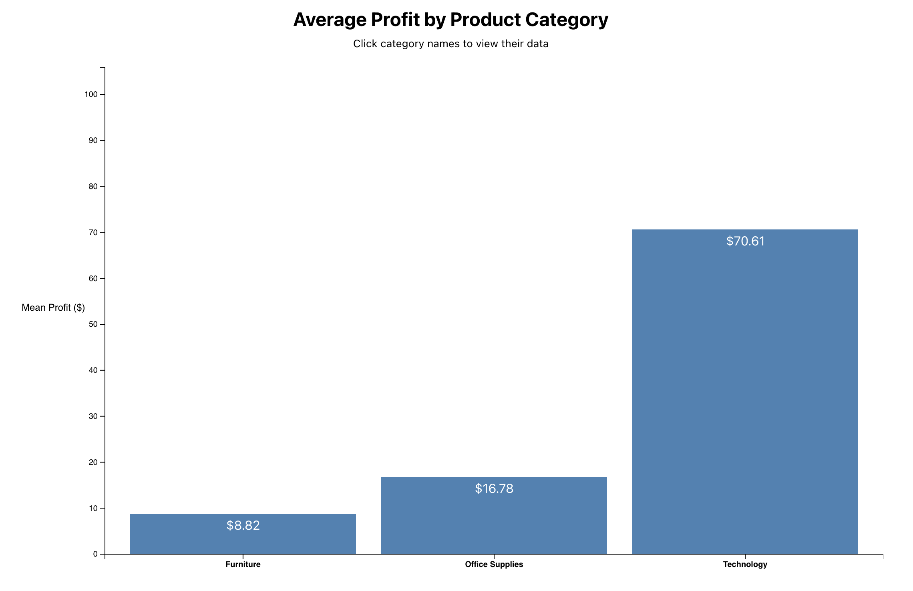
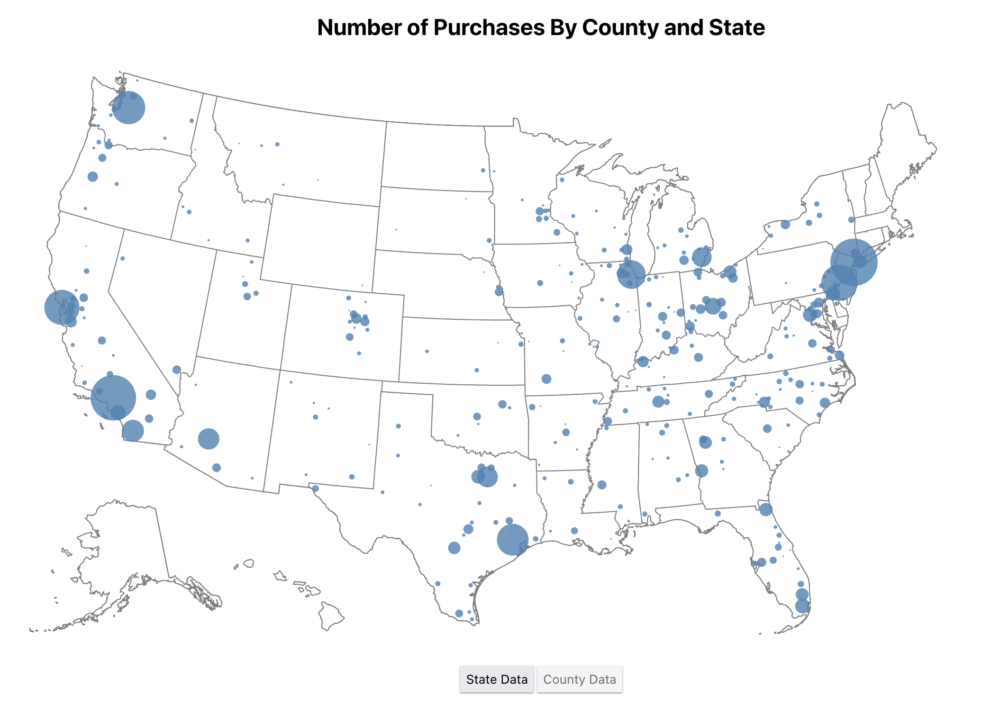
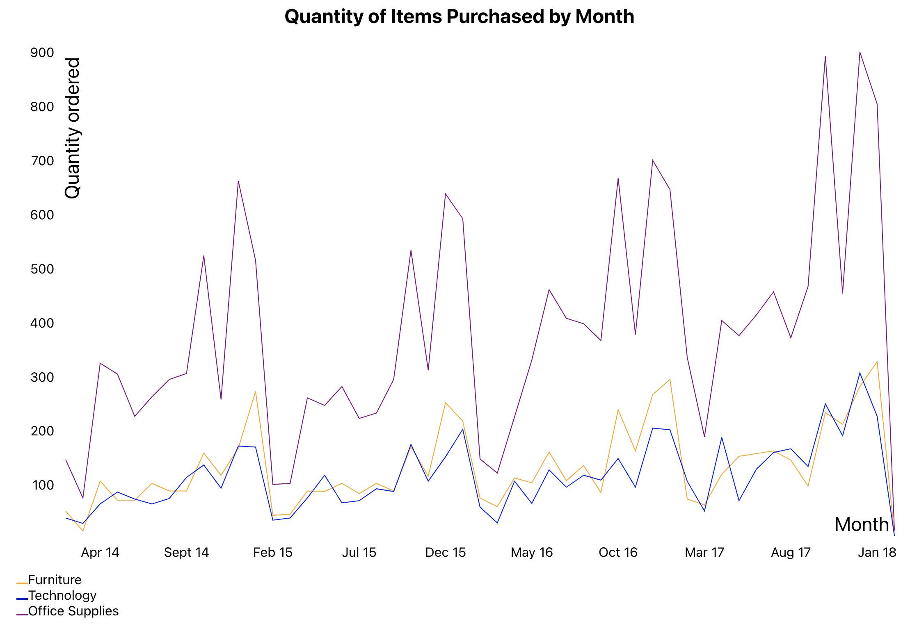

## DALI Data Visualization Challenge

## Summary

Using d3 and react-viz, I visualized some data from the "Super Store" Dataset. I made a bar graph to visualize average profits for each product category, a map to visualize where purchases are coming from, and a line graph to visualize the quantity of items purchased on a month-by-month basis.

## Usage

To use:

1. Type `yarn` in terminal to install packages
2. Type `yarn start` to start the web server
3. See the graphs at `localhost:3000`!

## Discussion and Analysis

Creating these three figures, the main challenge was writing clean, efficient integrations of d3 and svgs with React and Typescript. I paid close attention to the examples in the documentation, trying to understand them on a basic level so that I could implement them while using React best practices (ie not overusing Refs). This was my first time working with d3, which I was putting off because of how heavily it works with SVGs on a base level, but I was very satisfied with the level of flexibility provided with this apporach. With the line graph, I decided to use `react-vis`, a react library with premade features, since the figure was just a basic line graph. As expected, making the graph was very easy, but I don't have confidence that I could add flexibility or interactability with it.

I'll speak briefly about the insights into the data that these figures bring. The bar graph shows how profitable technological sales are, and that, while to a lesser extent, office supplies are also consistently profitable. Furniture sales are more inconsistent, with tables generally bringing a big loss for whatever reason. One fault with this graph is that it lacks the number of each type of sale and an indication of error margins. Such indicators, if added in the future, would allow for more insight into these stranger results to see if tables are really a terrible product or if the dataset is to blame. The map figure shows that, as expected, sales quantities are highest in the biggest cities, like NYC and LA. It was interesting to see some sales being made in places like the Idaho panhandle and across the rural midwest. The line graph shows that sales peak towards the end-of-year/holiday season every year. Additionally, this super store has been seeing higher and higher quantities of products sold, as the end-of-year peaks increase every year. Good for them! Office supplies seem to be bought in the highest quantity, which makes sense. Consumers are more likely to buy a dozen pens than a dozen tables or a dozen printers.

Future improvements would include adding interactability to all of the figures. Zooming in on the map would allow users to see things on a minute level and avoid the overlapping circles issue. With the line graph, users might want to hover their mouse over the line to see its exact numerical value at that point. As mentioned before, error bars and sample size indicators on the bar graph would improve the insights from that visualization.

## Authors

- Julian George

## Acknowledgements

The map figure owes a lot of guidance to [this example](https://observablehq.com/@d3/bubble-map/2?collection=@d3/d3-geo)

ZIP code to FIPS code conversion CSV comes from [here](https://data.world/niccolley/us-zipcode-to-county-state)
