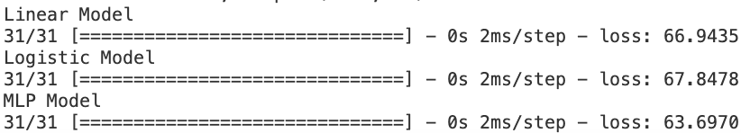
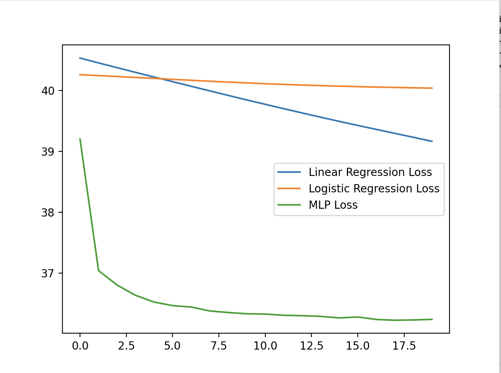
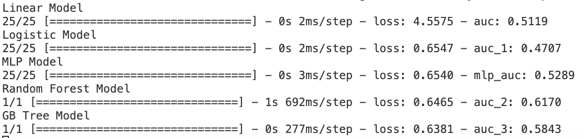
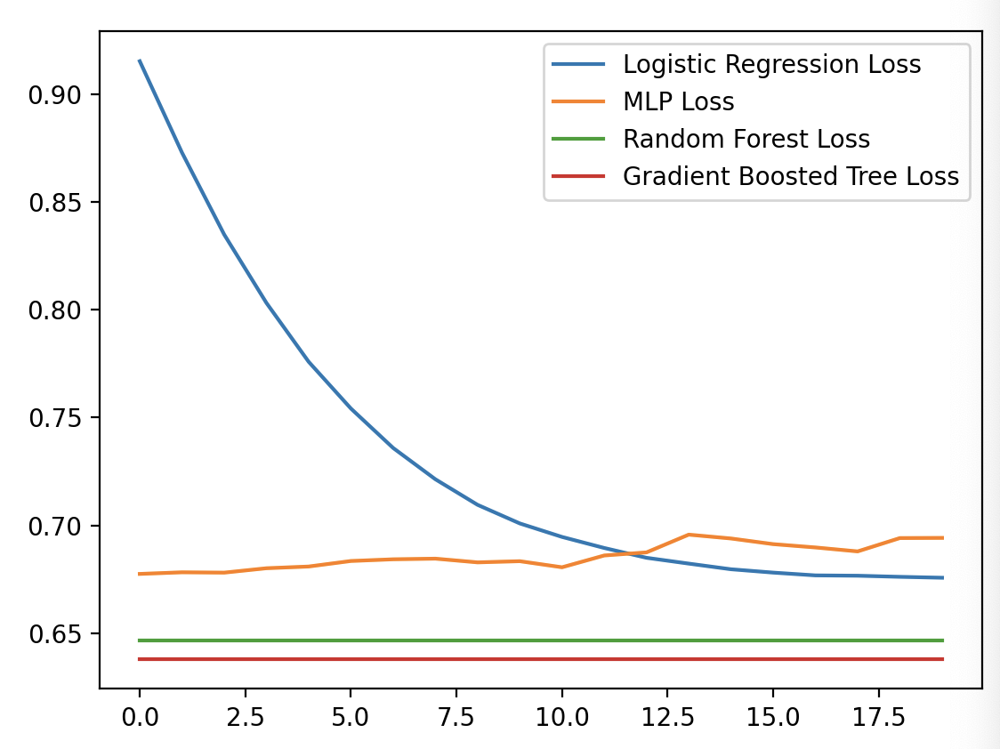
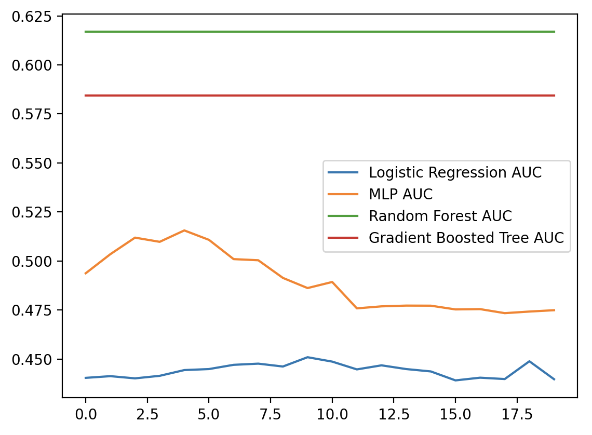

## DALI Machine Learning Challenge

### Julian George, 24W

## Usage

Feel free to set this up in a virtual environment - I didn't use one in development. To set it up, I do the following:

1. `pip3 install -r requirements.txt`
2. Run `python3 classification-learning.py` to run the classification model or `python3 regression-learning.py` to run the regression model

## Discussion and Results

I started out with the regression model, trying to predict the profit of a sale based on its date, the type of consumer ("Segment"), the region of the buyer (as opposed to the more minute and noisy "State" or "City"), the month it was bought, the type of shipping, and the quantity. I implemented a linear regression (and later a logistic regression) model for a baseline, and then built an MLP model. After completing my implementation, I initially had a tough time wrapping my head around the loss, since it initially was the average difference between the actual profit and the predicted profit, leading to high loss amounts (think ~20-50). I implemented loss normalization, turning that loss into a decimal percent. That didn't change the fact that my models performed poorly, with the best-performing MLP model being off by an average $63 dollars with the test set. After seeing these results (and testing if changing features or hyperparameters would help), I thought harder about the problem and the constraints, and came to the conclusion that the data provided isn't enough to predict the profit with any kind of accuracy, so I decided to move on to another problem.

### Regression Evaluation

### Regression Training Loss

My next problem was a binary classification problem. Based on all aspects of the purchase, I wanted to determine if the purchaser was an ordinary consumer or a corporate customer. The labels are based on the data's "Segment" column. One problem is that it's not totally clear what this "Segment" column signifies: I assumed it differentiated the customer between the two aforementioned categories, but that may not be correct. Anyways, I made a variety of models to predict this, from the baseline linear & logistic regression models, to random forest and gradient boosted tree models, to a standard MLP. I started with the same features as the regression model (with "Segment" as the label and "Profit" as one of the features), and, as expected with such a small dataset, the random forest performed the best. It, along with the rest of the models, initially had an AUC of ~0.53. Then, I added a new feature, which measures the amount of purchases the buyer (using the Customer ID and Name) has made in total. This brought all of the AUCs up, and the Random Forest's AUC up to ~0.61. This is still not a good result, and I used the automatic `tfdf` tuner to attempt to ge some more performance, but the tuned hyperparameters resulted in worse results for some reason. This disappointing result likely has to do, again, with the small size of the test data. Even worse, many rows have NaN values, which I dropped, resulting in an ultimate training matrix of ~3000 entries from the original 9994 rows. Future improvements would involve more in-depth feature pruning to remove features with the most NaN values, along with more data processing to fill in missing data (like I filled in empty customer IDs).

### Binary Classification Evaluation

### Binary Classification Training Performance

Note: the tree model performances on these graphs are just the performance from the test evaluation, graphed for easy comparison

